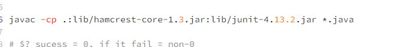

# Lab Report 5 - Putting it All Together (Week 9)

[live_page_for_GitHub](https://pussakornch.github.io/cse15l-lab-reports5/lab-report.html)

## Part 1 – Debugging Scenario

## Student:

Hello TA,

I write java files listExample and TestListExamples, then I want to grade it using my bash script called grade.sh.

I think I wrote the filter method correctly, my expectation is that somehow we cannot find the filter method

## TA response:

Hello student, 

I see your program, and both functions look correct (filter and merge). So, I will recommend you to check why the program cannot-

find filter method even if you have it in your Java files

One more thing, you should check your grade.sh. Remember the difference between Mac and Windows for Junit java.

## Student Response:

Thank you very much, TA! It is just like you said. I misplaced the filter method's argument name and learned the difference between the Junit Java implementation of Windows and Mac.

## Part 2 Reflection

I have learned a difficult bugs and problems may not come from big errors, 

but it could be from a small error just like the difference between the Junit Java implementation of Windows and Mac similar to what happened to the student.

I also realize the importance of working as a team because the more eyes we have to look into the program, the less likely that bugs will be overlooked. 
